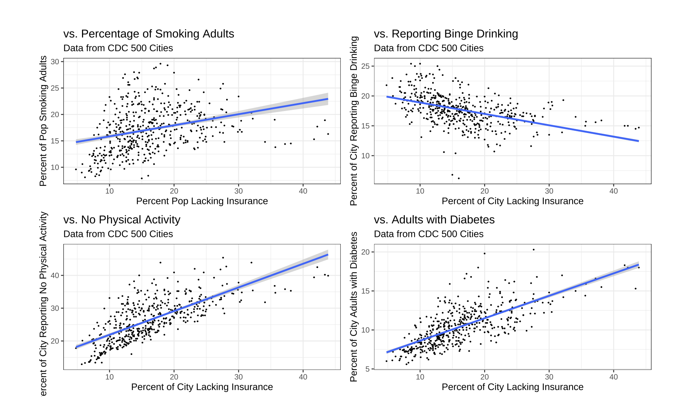

```{r load-packages, include = FALSE}
# Add any additional packages you need to this chunk
# Remove any packages from this list that you're not using
library(tidyverse)
library(tidymodels)
library(palmerpenguins)
library(knitr)
library(xaringanthemer)
```

```{r setup, include=FALSE}
# For better figure resolution
knitr::opts_chunk$set(
  fig.retina = 3, 
  dpi = 300, 
  fig.width = 6, 
  fig.asp = 0.618, 
  out.width = "70%"
  )
```

```{r load-data, include=FALSE}
# Load your data here
```

```{r style-slides, echo = FALSE}
style_xaringan(
  title_slide_background_image = "img/watercolour_sys02_img34_teacup-ocean.jpg"
)
```

```{r exploratory-correlations, echo = FALSE, out.width = "100%", fig.align = "center"}

```
---
```{r exploratory-maps, echo = FALSE, out.width = "100%", fig.align = "center"}

```
---
```{r regressiongraphs, echo = FALSE, out.width = "100%", fig.align = "center"}

```
---
```{r table1, echo = FALSE, out.width = "100%", fig.align = "center"}

```
---
```{r table2, echo = FALSE, out.width = "100%", fig.align = "center"}

```
---


