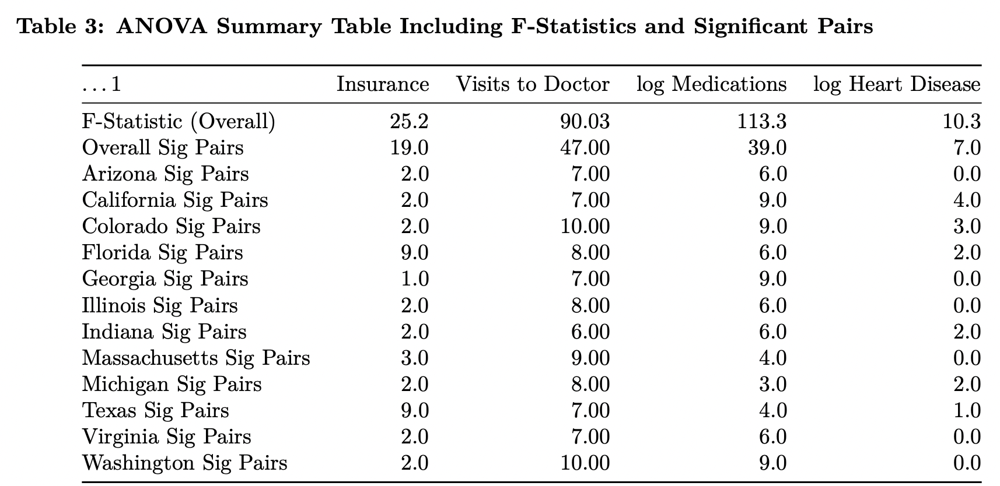

```{r load-packages, include = FALSE}
# Add any additional packages you need to this chunk
# Remove any packages from this list that you're not using

library(tidyverse)
library(tidymodels)
library(knitr)
library(xaringanthemer)
library(fontawesome)
library(readr)
library(readxl)
library(dplyr)
library(tidymodels)
library(patchwork)
library(plotly)
library(widgetframe)
library(here)
library(sf)
library(rnaturalearth)
library(rnaturalearthdata)
library(rgeos)
library(patchwork)
library(ggpubr)
library(knitr)
library(xaringanthemer)
```

```{r setup, include=FALSE}
# For better figure resolution
knitr::opts_chunk$set(
  fig.retina = 3, 
  dpi = 300, 
  fig.width = 6, 
  fig.asp = 0.618, 
  out.width = "70%"
  )
```


```{r upload-insurance-data, echo= FALSE, message= FALSE, warning= FALSE}
insurance <- read_excel(here("data/insurance_500_cities.xlsx"))
```

```{r upload-visits-to-doctor-data, echo= FALSE, message= FALSE, warning= FALSE}
visits_to_doctor <- read_excel(here("data/visits_to_doctor.xlsx"))
```

```{r upload-medicine-high-bp-data, echo= FALSE, message= FALSE, warning= FALSE}
medicine_high_bp <- read_excel(here("data/medicine_high_bp.xlsx"))
```

```{r upload-smoking-data, echo= FALSE, message= FALSE, warning= FALSE}
smoking <- read_excel(here("data/smoking.xlsx"))
```

```{r upload-binge-drinking-data, echo= FALSE, message= FALSE, warning= FALSE}
binge_drinking <- read_excel(here("data/binge_drinking.xlsx"))
```

```{r upload-physical-activity-data, echo= FALSE, message= FALSE, warning= FALSE}
physical_activity <- read_excel(here("data/physical_activity.xlsx"))
```

```{r upload-heart-disease-data, echo= FALSE, message= FALSE, warning= FALSE}
heart_disease <- read_excel(here("data/heart_disease.xlsx"))
```

```{r upload-diabetes-data, echo= FALSE, message=FALSE, warning= FALSE}
diabetes <- read_excel(here("data/diabetes.xlsx"))
```

```{r upload-kidney-disease-data, echo= FALSE, message= FALSE, warning= FALSE}
kidney_disease <- read_excel(here("data/kidney_disease.xlsx"))
```

```{r upload-ANOVA-summary-data, echo= FALSE, message= FALSE, warning= FALSE}
ANOVA_Summary_table <- read_excel(here("data/ANOVA Summary table.xlsx"))
```

```{r upload-regressions-data, echo= FALSE, message= FALSE, warning= FALSE}
regressions <- read_excel(here("data/regressions.xlsx"))
```

```{r upload-regression-p-value-data, echo= FALSE, message= FALSE, warning= FALSE}
regressionpvalues <- read_excel(here("data/regressionpvalues.xlsx"))
```

```{r edit-insurance-data, echo= FALSE, message= FALSE, warning= FALSE}
edit_insurance <- insurance %>%
  select(StateAbbr, StateDesc, CityName, Data_Value_Type, Data_Value, GeoLocation) %>%
  filter(Data_Value_Type %in% c("Age-adjusted prevalence")) %>%
  group_by(CityName) %>%
  mutate(mean_value = mean(Data_Value)) %>%
  select(StateAbbr, StateDesc, CityName, mean_value, GeoLocation) %>%
  distinct(CityName, .keep_all = TRUE) %>%
  rename("insurance" = mean_value)
```

```{r edit-visits-to-doctor-data, echo= FALSE, message= FALSE, warning= FALSE}
edit_visits_to_doctor <- visits_to_doctor %>%
  select(StateAbbr, StateDesc, CityName, Data_Value_Type, Data_Value, GeoLocation) %>%
  filter(Data_Value_Type %in% c("Age-adjusted prevalence")) %>%
  group_by(CityName) %>%
  mutate(mean_value = mean(Data_Value)) %>%
  select(StateAbbr, StateDesc, CityName, mean_value, GeoLocation) %>%
  distinct(CityName, .keep_all = TRUE) %>%
  rename("visits_to_doctor" = mean_value)
```

```{r edit-medicine-high-bp-data, echo= FALSE, message= FALSE, warning= FALSE}
edit_medicine_high_bp <- medicine_high_bp %>%
  select(StateAbbr, StateDesc, CityName, Data_Value_Type, Data_Value, GeoLocation) %>%
  filter(Data_Value_Type %in% c("Age-adjusted prevalence")) %>%
  group_by(CityName) %>%
  mutate(mean_value = mean(Data_Value)) %>%
  select(StateAbbr, StateDesc, CityName, mean_value, GeoLocation) %>%
  distinct(CityName, .keep_all = TRUE) %>%
  rename("medicine_high_bp" = mean_value)
```

```{r edit-smoking-data, echo= FALSE, message= FALSE, warning= FALSE}
edit_smoking <- smoking %>%
  select(StateAbbr, StateDesc, CityName, Data_Value_Type, Data_Value, GeoLocation) %>%
  filter(Data_Value_Type %in% c("Age-adjusted prevalence")) %>%
  group_by(CityName) %>%
  mutate(mean_value = mean(Data_Value)) %>%
  select(StateAbbr, StateDesc, CityName, mean_value, GeoLocation) %>%
  distinct(CityName, .keep_all = TRUE) %>%
  rename("smoking" = mean_value)
```

```{r edit-binge-drinking-data, echo= FALSE, message= FALSE, warning= FALSE}
edit_binge_drinking <- binge_drinking %>%
  select(StateAbbr, StateDesc, CityName, Data_Value_Type, Data_Value, GeoLocation) %>%
  filter(Data_Value_Type %in% c("Age-adjusted prevalence")) %>%
  group_by(CityName) %>%
  mutate(mean_value = mean(Data_Value)) %>%
  select(StateAbbr, StateDesc, CityName, mean_value, GeoLocation) %>%
  distinct(CityName, .keep_all = TRUE) %>%
  rename("binge_drinking" = mean_value)
```

```{r edit-physical-activity, echo= FALSE, message= FALSE, warning= FALSE}
edit_physical_activity <- physical_activity %>%
  select(StateAbbr, StateDesc, CityName, Data_Value_Type, Data_Value, GeoLocation) %>%
  filter(Data_Value_Type %in% c("Age-adjusted prevalence")) %>%
  group_by(CityName) %>%
  mutate(mean_value = mean(Data_Value)) %>%
  select(StateAbbr, StateDesc, CityName, mean_value, GeoLocation) %>%
  distinct(CityName, .keep_all = TRUE) %>%
  rename("physical_activity" = mean_value)
```

```{r edit-heart-disease-data, echo= FALSE, message= FALSE, warning= FALSE}
edit_heart_disease <- heart_disease %>%
  select(StateAbbr, StateDesc, CityName, Data_Value_Type, Data_Value, GeoLocation) %>%
  filter(Data_Value_Type %in% c("Age-adjusted prevalence")) %>%
  group_by(CityName) %>%
  mutate(mean_value = mean(Data_Value)) %>%
  select(StateAbbr, StateDesc, CityName, mean_value, GeoLocation) %>%
  distinct(CityName, .keep_all = TRUE) %>%
  rename("heart_disease" = mean_value)
```

```{r edit-diabetes-data, echo= FALSE, message= FALSE, warning= FALSE}
edit_diabetes <- diabetes %>%
  select(StateAbbr, StateDesc, CityName, Data_Value_Type, Data_Value, GeoLocation) %>%
  filter(Data_Value_Type %in% c("Age-adjusted prevalence")) %>%
  group_by(CityName) %>%
  mutate(mean_value = mean(Data_Value)) %>%
  select(StateAbbr, StateDesc, CityName, mean_value, GeoLocation) %>%
  distinct(CityName, .keep_all = TRUE) %>%
  rename("diabetes" = mean_value)
```

```{r edit-kidney-disease-data, echo= FALSE, message= FALSE, warning= FALSE}
edit_kidney_disease <- kidney_disease %>%
  select(StateAbbr, StateDesc, CityName, Data_Value_Type, Data_Value, GeoLocation) %>%
  filter(Data_Value_Type %in% c("Age-adjusted prevalence")) %>%
  group_by(CityName) %>%
  mutate(mean_value = mean(Data_Value)) %>%
  select(StateAbbr, StateDesc, CityName, mean_value, GeoLocation) %>%
  distinct(CityName, .keep_all = TRUE) %>%
  rename("kidney_disease" = mean_value)
```

```{r join-data, echo= FALSE, warning= FALSE, message= FALSE}
data_500_cities <- edit_insurance %>%
  left_join(edit_visits_to_doctor) %>%
  left_join(edit_medicine_high_bp) %>%
  left_join(edit_smoking) %>%
  left_join(edit_binge_drinking) %>%
  left_join(edit_physical_activity) %>%
  left_join(edit_heart_disease) %>%
  left_join(edit_diabetes) %>%
  left_join(edit_kidney_disease) %>%
  select(c(StateAbbr, StateDesc, CityName, insurance, visits_to_doctor, medicine_high_bp, smoking, binge_drinking, physical_activity, heart_disease, diabetes, kidney_disease, GeoLocation))
```

```{r map-vis, echo= FALSE, warning= FALSE, message= FALSE, include= FALSE}
theme_set(theme_bw())
world <- ne_countries(scale = "medium", returnclass = "sf")
names(world)
state.name
```

``` {r states-desc, echo= FALSE, warning= FALSE, message= FALSE}
states <- map_data("state")
states %>%
  mutate(StateDesc = str_to_title(region)) -> states
```

```{r filter-ANOVA, echo= FALSE, warning= FALSE, message= FALSE}
ANOVA_data_500_cities <- data_500_cities %>%
  filter(StateDesc %in% c("Arizona", "California", "Colorado", "Florida", "Georgia", "Illinois", "Indiana", "Massachusetts", "Michigan", "North Carolina", "Texas", "Virginia", "Washington")) %>%
  mutate(linsruance = log(insurance)) %>%
  mutate(lvisits_to_doctor = log(visits_to_doctor)) %>%
  mutate(lmedicine_high_bp = log(medicine_high_bp)) %>%
  mutate(lheart_disease = log(heart_disease)) %>%
  mutate(ldiabetes = log(diabetes)) %>%
  mutate(lkidney_disease = log(kidney_disease))
```

```{r load-map-data, echo= FALSE, message= FALSE, warning= FALSE}
map_ANOVA_data_500_cities <- ANOVA_data_500_cities %>%
  group_by(StateDesc) %>%
  mutate(insurancemean = mean(insurance)) %>%
  mutate(visits_to_doctormean = mean(visits_to_doctor)) %>%
  mutate(lmedicine_high_bpmean = mean(lmedicine_high_bp)) %>%
  mutate(lheart_diseasemean = mean(lheart_disease))

map_data <- map_ANOVA_data_500_cities %>% 
  left_join(states, by = "StateDesc")
```

```{r style-slides, include = FALSE}
style_xaringan(
  title_slide_background_image = "img/watercolour_sys02_img34_teacup-ocean.jpg"
)
```


```{r exploratory-scatterplots, warning= FALSE, message= FALSE, echo= FALSE}
plot1 <- data_500_cities %>%
  ggplot(mapping = aes(x = insurance, y = smoking)) +
  geom_point() +
  labs(
    title = "vs. % Adults Smoking",
    subtitle = "where each datapoint represents a city",
    x = "% Lack Insurance",
    y = "% Adults Smoking"
  )

plot2 <- data_500_cities %>%
  ggplot(mapping = aes(x = insurance, y = binge_drinking)) +
  geom_point() +
  labs(
    title = "vs. % Adults Binge Drinking",
    subtitle = "where each datapoint represents a city",
    x = "% Lack Insurance",
    y = "% Binge Drinking"
  )

plot3 <- data_500_cities %>%
  ggplot(mapping = aes(x = insurance, y = medicine_high_bp)) +
  geom_point() +
  labs(
    title = "vs. % Taking BP Meds",
    subtitle = "where each datapoint represents a city",
    x = "% Lack Insurance",
    y = "% Taking High BP Meds"
  )

plot4 <- data_500_cities %>%
  ggplot(mapping = aes(x = insurance, y = heart_disease)) +
  geom_point() +
  labs(
    title = "vs. % with Heart Disease",
    subtitle = "where each datapoint represents a city",
    x = "% Lack Insurance",
    y = "% with Heart Disease"
  )

plot5 <- data_500_cities %>%
  ggplot(mapping = aes(x = insurance, y = diabetes)) +
  geom_point() +
  labs(
    title = "vs. % with Diabetes",
    subtitle = "where each datapoint represents a city",
    x = "% Lack Insurance",
    y = "% with Diabetes"
  )

plot6 <- data_500_cities %>%
  ggplot(mapping = aes(x = insurance, y = kidney_disease)) +
  geom_point() +
  labs(
    title = "vs. % with Kidney Disease",
    subtitle = "where each datapoint represents a city",
    x = "% Lack Insurance",
    y = "% Kidney Disease"
  )
```

```{r linear-regression-access-smoking-int, include= FALSE}
access_smoking_fit <- linear_reg() %>%
  set_engine("lm") %>%
  fit(smoking ~ insurance + visits_to_doctor + medicine_high_bp, data = data_500_cities)
access_smoking_fit_aug <- augment(access_smoking_fit$fit)
tidy(access_smoking_fit) %>%
  print()
```

```{r graph-regression-access-smoking-all-int, include=FALSE}
smokingregressiongraph <- data_500_cities %>%
ggplot(mapping = aes(x = insurance, y = smoking)) + 
geom_point(size = 0.25) +
geom_smooth(method = "lm", data = access_smoking_fit_aug, mapping = aes(x = insurance, y = .fitted)) +
  labs(
    title = "vs. Percentage of Smoking Adults",
    subtitle = "Data from CDC 500 Cities",
    x = "Percent Pop Lacking Insurance",
    y = "Percent of Pop Smoking Adults"
  )
```

```{r linear-regression-access-binge-drinking-int, include= FALSE}
access_binge_drinking_fit <- linear_reg() %>%
  set_engine("lm") %>%
  fit(binge_drinking ~ insurance + visits_to_doctor + medicine_high_bp, data = data_500_cities)
access_binge_drinking_fit_aug <- augment(access_binge_drinking_fit$fit)
tidy(access_binge_drinking_fit) %>%
  print()
```

```{r graph-regression-access-binge-drinking-all-int, include=FALSE}
bingedrinkingregressiongraph <- data_500_cities %>%
ggplot(mapping = aes(x = insurance, y = binge_drinking)) + 
geom_point(size = 0.25) +
geom_smooth(method = "lm", data = access_binge_drinking_fit_aug, mapping = aes(x = insurance, y = .fitted)) +
  labs(
    title = "vs. Reporting Binge Drinking",
    subtitle = "Data from CDC 500 Cities",
    x = "Percent of City Lacking Insurance",
    y = "Percent of City Reporting Binge Drinking"
  ) 
```

```{r linear-regression-access-physical-activity-all-int, include= FALSE}
access_physical_activity_fit <- linear_reg() %>%
  set_engine("lm") %>%
  fit(physical_activity ~ insurance + visits_to_doctor + medicine_high_bp, data = data_500_cities)
access_physical_activity_fit_aug <- augment(access_physical_activity_fit$fit)
tidy(access_physical_activity_fit) %>%
  print()
```

```{r graph-regression-access-physical-activity-all-int, include=FALSE}
physicalactivityregressiongraph <- data_500_cities %>%
ggplot( mapping = aes(x = insurance, y = physical_activity)) + 
geom_point(size = 0.25) +
geom_smooth(method = "lm", data = access_physical_activity_fit_aug, mapping = aes(x = insurance, y = .fitted)) +
  labs(
    title = "vs. No Physical Activity",
    subtitle = "Data from CDC 500 Cities",
x = "Percent of City Lacking Insurance",
y = "Percent of City Reporting No Physical Activity"
  )
```

```{r linear-regression-access-diabetes-int, include= FALSE}
access_diabetes_fit <- linear_reg() %>%
  set_engine("lm") %>%
  fit(diabetes ~ insurance + visits_to_doctor + medicine_high_bp, data = data_500_cities)
access_diabetes_fit_aug <- augment(access_diabetes_fit$fit)
tidy(access_diabetes_fit) %>%
  print()
```

```{r graph-regression-access-diabetes-all-int, include=FALSE}
diabetesregressiongraph <- data_500_cities %>%
ggplot(mapping = aes(x = insurance, y = diabetes)) + 
geom_point(size = 0.25) +
geom_smooth(method = "lm", data = access_diabetes_fit_aug, mapping = aes(x = insurance, y = .fitted)) +
  labs(
    title = "vs. Adults with Diabetes",
    subtitle = "Data from CDC 500 Cities",
x = "Percent of City Lacking Insurance",
y = "Percent of City Adults with Diabetes"
  )
```

```{r linear-regression-access-smoking_no_int, include=FALSE}
access_smoking_fit <- linear_reg() %>%
  set_engine("lm") %>%
  fit(smoking ~ insurance + visits_to_doctor + medicine_high_bp, data = data_500_cities)
access_smoking_fit_aug <- augment(access_smoking_fit$fit)
tidy(access_smoking_fit)
```

```{r linear-regression-access-binge-drinking-no-int, include=FALSE}
# a boring regression
access_binge_drinking_fit <- linear_reg() %>%
  set_engine("lm") %>%
  fit(binge_drinking ~ insurance + visits_to_doctor + medicine_high_bp, data = data_500_cities)
access_binge_drinking_fit_aug <- augment(access_binge_drinking_fit$fit)
tidy(access_binge_drinking_fit)
```

```{r linear-regression-access-physical-activity-no-int, include=FALSE}
access_physical_activity_fit <- linear_reg() %>%
  set_engine("lm") %>%
  fit(physical_activity ~ insurance + visits_to_doctor + medicine_high_bp, data = data_500_cities)
access_physical_activity_fit_aug <- augment(access_physical_activity_fit$fit)
tidy(access_physical_activity_fit)
```

---

## Background Information and Significance


- America, unlike other developed countries, does not have a universal healthcare program, meaning that not all individuals are granted free health insurance by the government. 
- Levy and Meltzer (2008): access to health insurance impacts other health outcomes.
- Zuckerman et al. (1999): health uninsurance rates vary across states, with California, Texas, and Colorado having diproportionately high uninsurance rates.

---
## 500 Cities Dataset
This dataset is provided by the Center for Disease Control and Prevention (CDC), Division of Population Health, Epidemiology and Surveillance Branch.

Data from this dataset is sourced from 28,000 census tracts in the 2010 census population data, Behavioral Risk Factor Surveillance System (BRFSS) data (2017, 2016), and American Community Survey (ACS) 2013-2017, 2012-2016 estimates. All data was collected through the form of surveys.

Variables of Interest:
- Healthcare Access for Adults (18+): Percent of City Population 1) that Lacks Insurance 2) with visits to doctor for routine checkup within the past year 3) who have high blood pressure and are taking medicine for high blood pressure control.
- Geographic Distribution by State
- Behavior for Adults (18+): Percent of city population 1) currently smoking 2) currently reporting binge drinking habits 3) reporting No leisure-time physical activity
- Health Outcomes for Adults (18+): Percent of city population 1) with coronary heart disease 2) diagnosed with diabetes 3) with kidney disease

---

## Research Questions
-  Do cities with a greater lack of healthcare access have poorer mental health and/or physical health outcomes? 

- Does healthcare access, mental health, and/or physical health outcomes vary by state?

For Research Question 1, Healthcare Access Variables are the explanatory variables, whereas Behavior and Health Outcomes are the response variables. 
For Research Question 2, Geographic Distribution by State is the explanatory variable, and all health indicators are the response variables.
---
##Transformations to Data Set
- The original dataset includes about 29,000 observations, with multiple measurements for each city based on the data source (census, BRFSS, ACS). We restricted our dataset to only include variables on percent of city
with lack of insurance, visiting the doctor, taking high blood pressure medications, smoking, reporting binge drinking, not having physical activity, with heart disease, with diabetes, and with kidney disease. We took the mean of all the age-adjusted prevalence measurements within a city and filtered our dataset to these means. As a result, there was only one measurement per city. For ANOVA testing, we filtered our dataset to
only include states with measurements for at least 10 cities and created logarithmic versions of all variables.
---

## Data Analysis
#### Research Question 1 
We modeled our data with a linear regression to determine if there were significant correlations between healthcare access variables and health behaviors and physical health outcomes. We did not add any interactions to our linear models.  To determine whether a linear regression model would be appropriate for the physical and behavioral health outcomes, we made residual plots for each to check for any patterns in the residuals. For smoking, binge drinking, physical activity, and diabetes, there didn’t seem to be a significant pattern in the residual plot, so a linear regression model was appropriate.

#### Research Question 2

We conducted ANOVA testing to look for variances of health access, behavior, and outcome variables between states. 

State distributions of variables that met ANOVA assumptions: percent lack of insurance, percent visiting the doctor, log percent with heart disease, log percent taking high BP medications

Bonferroni Correction: p = 0.000641025641

---
## Research Question 1 Exploratory Data Analysis
#### Scatterplot: Lack of Insurance Vs Physical and Behavioural Outcomes

```{r ggarrange-scatterplots, echo= FALSE, message= FALSE, warning= FALSE, fig.width = 10, fig.height = 6}
ggarrange(plot1, plot2, plot3, plot4, plot5, plot6, nrow = 2, ncol = 3)
```

---
## Results: Linear Model (Access Variables vs Outcomes) + Scatterplot (Insurance vs Outcomes)

```{r ggarrange-regressions, echo= FALSE, message= FALSE, warning= FALSE, fig.width = 10, fig.height = 6}
ggarrange(smokingregressiongraph, bingedrinkingregressiongraph, physicalactivityregressiongraph, diabetesregressiongraph, nrow = 2, ncol = 2)
```
---

### Table 1: Intercepts and Coefficients for Linear Regressions (No Interactions)
```{r regressions-table, echo = FALSE}
kable(head(regressions), format = "html")
```

---
### Table 2: P-Values of Intercepts and Coefficients for Linear Regressions (No Interactions)
```{r regressionpvalues-table, echo = FALSE, fig.height = 5}
kable(head(regressionpvalues), format = "html")
```

---
### Conclusion For Research Question 1
- The linear regression models demonstrate that there is generally a positive correlation between lack of health insurance/ healthcare access and negative behaviors and physical health outcomes.

- The linear regression on the impact health access variables on physical activity had the highest adjusted R-squared value (around 0.8). The smoking and diabetes regressions also had fairly high adjusted R-squared values. The binge drinking regression had a low R-squared value of around 0.2.
---
## Research Question 2
The maps below visualize the distribution healthcare access, behavior, and outcome variables by state. Only states that have at least ten observations are included, and only four variables that fit the assumptions for ANOVA testing.

```{r state-map-insruance, echo= FALSE, message= FALSE, warning= FALSE, fig.height= 3, fig.width= 5}
map1 <- ggplot(data = map_data, aes(x = long, y = lat, group = group, fill = insurancemean)) + 
  geom_polygon(color = "white")+
    labs(
       fill = "Percent No 
Insurance",
       title = "Mean % No Health Insurance",
subtitle = "Data Retreived from CDC 500 Cities")
```

```{r state-map-visits_to_doctor, echo= FALSE, message= FALSE, warning= FALSE, fig.height= 3, fig.width= 5}
map2 <- ggplot(data = map_data, aes(x = long, y = lat, group = group, fill = visits_to_doctormean)) + 
  geom_polygon(color = "white")+
    labs(
       fill = "% Visits 
to Doctor",
       title = "Mean % Pop Visiting Doctor",
subtitle = "Data Retreived from CDC 500 Cities")
```

```{r state-map-lhigh-bp-meds, echo= FALSE, message= FALSE, warning= FALSE, fig.height= 3, fig.width= 5}
map3 <- ggplot(data = map_data, aes(x = long, y = lat, group = group, fill = lmedicine_high_bpmean)) + 
  geom_polygon(color = "white")+
    labs(
       fill = "Log Percent Taking 
High BP Meds",
       title = "Mean Log % Taking High BP Meds",
subtitle = "Data Retreived from CDC 500 Cities")
```

```{r state-map-lheart-disease, echo= FALSE, message= FALSE, warning= FALSE, fig.height= 3, fig.width= 5}
map4 <- ggplot(data = map_data, aes(x = long, y = lat, group = group, fill = lheart_diseasemean)) + 
  geom_polygon(color = "white")+
    labs(
       fill = "Log Percent with 
Heart Disease",
       title = "Mean Log % with Heart Disease",
subtitle = "Data Retreived from CDC 500 Cities")
```

```{r ggarrange-maps, echo= FALSE, message= FALSE, warning= FALSE, fig.height= 6, fig.width = 10}
ggarrange(map1, map2, map3, map4, nrow = 2, ncol = 2)
```

---
## Anova Results
```{r anova-results, echo = FALSE, out.width = "100%", fig.align = "center"}

```
---
## Conclusion for Research Question 2

The ANOVA testing demonstrated that:
- there is variance within and across states for lack of insurance, visits to doctor, heart disease, and taking High BP medication rates.
- Based on their higher F-squared values and
greater number of significant pairs, visits to doctor and High BP Medication rates seemed to have more variance than lack of insurance and heart disease.

---
## Limitations
- In the Linear Regression Models without Interactions, some of the adjusted R-square values were not close to 1. 

- For question 1, it is highly unlikely that the explanatory variables are independent; for example, the fact that a person who has insurance is more likely to visit the doctor and take medications demonstrates that these groups are not independent. A way to remedy this would be to include interactions between correlated explanatory variables, but interpreting interactions between two numerical variables is beyond the scope of this course.
- For question 2, a Bonferroni correction is implemented on the ANOVA testing because it is unlikely that the state distributions
are independent from each other, but the research is limited in identifying what exactly causes a lack of
independence. Identifying this cause could allow one to correct the lack of independence more accurately.
---
## Further Research

- For question 1, further research could look into causes for the correlations between the variables in the linear regressions. In particular, it should investigate why there is a negative correlation between percent of city lacking health care access and percent of city binge drinking. A different type of regression model would likely be more appropriate and have higher adjusted R-square values closer to 1. 
- Look into different types of regression models for the data, but this is beyond the scope of the course.
- For question 2, Further research should investigate the socioeconomic and policy factors that contribute to differences between
and within states. Are the differences due to differing statewide healthcare policies or the result of inherent
economic inequality between states?

---
## References
https://chronicdata.cdc.gov/500-Cities-Places/500-Cities-Local-Data-for-Better-Health-2019-relea/6vp6-
wxuq
https://www.urban.org/sites/default/files/publication/66251/309311-Snapshots- of -America- sFamilies.PDF
https://www.annualreviews.org/doi/abs/10.1146/annurev.publhealth.28.021406.144042

---


